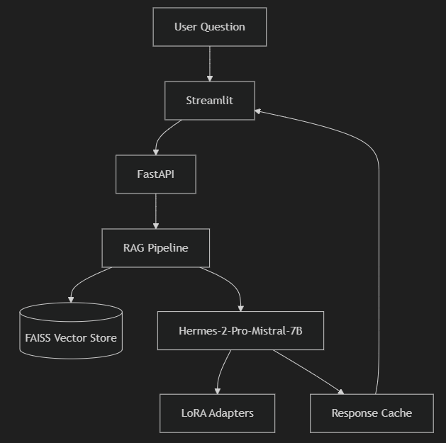

+++
date = '2025-06-22T00:45:20+08:00'
draft = false
title = 'Ask My Docs AI Assistant'
tags = ["AI", "LLM", "Project Showcase"]
description = 'Showcase of an end-to-end AI assistant built using NLP, LLM, RAG, LangChain, and LoRA.'
author= ["deanngkwanlung"]
+++

# 🚀 AskMyDocsAI: Your Intelligent Document Assistant 📚🤖

## 💯 Motivation
After mastering core concepts in NLP and Large Language Models (LLMs), I decided to apply these skills to create AskMyDocsAI, a comprehensive AI assistant. My goal was to build a practical, interactive tool that allows users to effortlessly extract accurate, document-grounded answers from their own uploaded documents.

This project integrates several advanced AI techniques and frameworks, including:

- **Retrieval-Augmented Generation (RAG)** for improved accuracy.

- **LangChain** for enhanced reasoning and agent-based interactions.

- **LoRA fine-tuning (QLoRA)** for efficiently training large models on consumer hardware (RTX 3060 GPU).

It has also provided an excellent opportunity to dive deeply into real-world challenges like cloud deployment, scalable architecture, and user-friendly interfaces.

---

## 🧠 Key Features

- 📤 **Document Upload & Processing**: Supports PDFs, DOCX, TXT, and CSV, parsed and indexed using a FAISS vector store.

- 🔍 **Retrieval-Augmented QA**: Delivers answers grounded in document content, significantly reducing hallucinations.

- 🎛️ **LoRA Fine-Tuning (QLoRA)**: Enables efficient fine-tuning of large language models (7B+) using consumer GPUs (like RTX 3060).

- 🛠️ **LangChain Agent Integration**: Handles complex, multi-step queries using ReAct paradigm.

- ⚡ **FastAPI & Streamlit Frontend**: User-friendly web interface connected via RESTful API for smooth interactions.

---

## 🔍 Model Selection and Implementation

Initially, the system was configured with `meta-llama/Llama-3.1-8B`. However, for improved instruction-following capability and superior retrieval performance, I transitioned to using `NousResearch/Hermes-2-Pro-Mistral-7B`. This model excels in coherence and is optimized specifically for retrieval tasks, making it ideal for document-based question answering.

---

## 🏗️ System Architecture
Here's how the system processes your questions:


---

## 🛠️ Technical Challenges & Solutions

1. GPU Constraints: Given my RTX 3060 GPU (6GB VRAM), I adopted QLoRA fine-tuning to optimize resource usage.

2. Optimizing RAG Pipeline: Extensive experimentation determined optimal chunking, MMR diversity, FAISS indexing, and Cross-Encoder reranking strategies to maximize retrieval quality.

3. Frontend Integration with Streamlit: Leveraged Streamlit’s Python integration capabilities, simplifying UI development by directly interacting with the backend FastAPI services.

4. RAG Pipeline Development: A significant portion of development time was spent refining the rag_pipeline.py for optimal document retrieval, query processing, and answer generation, including robust caching strategies.

5. Fine-Tuning Efficiency: Prepared data carefully to maintain quality and relevance, using efficient formats (JSONL, Parquet, Arrow) for fine-tuning datasets.

---

## 📊 Training Procedure

- **Dataset**: Alpaca-cleaned (10,000 samples)

- **Method**: LoRA (Low-Rank Adaptation)

- **Epochs**: 3

- **Batch Size**: 4 (with gradient accumulation)

- **Learning Rate**: 1e-4

- **Optimizer**: AdamW with cosine decay and warm-up

- **Hardware**: RunPod Cloud (NVIDIA RTX A5000 GPU)

Training logs monitored via TensorBoard and WandB for thorough performance tracking.

---

## 📈 Evaluation Metrics

- **Validation Loss**: Consistent decrease, indicating stable and effective training.

- **Instruction-Following Accuracy**: Enhanced coherence and context-awareness after fine-tuning.

---

## 🌐 Future Direction

- **Enhanced Training**: Train the entire dataset with larger models for greater accuracy.

- **Cloud Deployment**: Scale AskMyDocsAI deployment on AWS, GCP, or Azure.

- **Multi-Document Support**: Enable simultaneous multi-document uploads for comparative analyses.

- **Conversational Interface**: Develop sustained, multi-turn dialogue interactions similar to ChatGPT.

---

## 💡 Why RAG and LoRA?

- **RAG**: Keeps LLM answers factually accurate by dynamically retrieving relevant, up-to-date information directly from documents at query-time.

- **LoRA**: Allows lightweight, efficient customization of the model’s instruction-following capability, making domain-specific adaptations quick and resource-friendly.

---

## ⚙️ Quick Start Guide

To quickly deploy AskMyDocsAI locally:
```bash
git clone https://github.com/kwanlung/ask-my-docs-ai.git
cd AskMyDocsAI
pip install -r requirements.txt
uvicorn src.app:app --host localhost --port 8000
streamlit run streamlit_app.py
```

---

## 🤝 Contribution

Feel free to contribute via GitHub issues or pull requests!

---

## 📜 License

MIT License

---

## 📬 Connect with Me
<b>Dean Ng Kwan Lung</b>  
Blog        : [Portfolio](https://kwanlung.github.io/)  
LinkedIn    : [LinkedIn](https://www.linkedin.com/in/deanng00/)  
GitHub      : [GitHub](https://github.com/kwanlung)  
Email       : kwanlung123@gmail.com